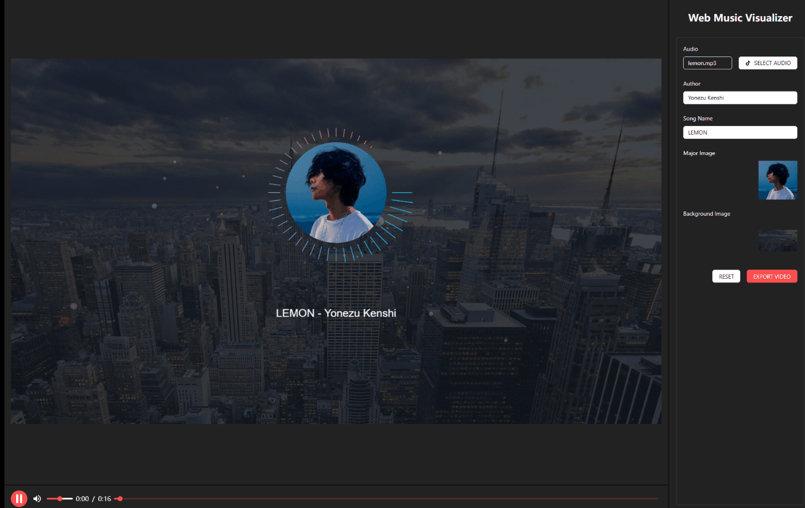

# Web Music Visualizer

A web-based music visualization tool built with React + TypeScript + Vite, using PixiJS for audio visualization effects.


## Features

- 🎵 Audio Visualization: Real-time audio waveform and spectrum display
- 🎨 Particle Effects: Rich particle animations using PixiJS
- 📹 Video Export: Export visualizations as MP4 videos
- 🎚️ Audio Controls: Volume adjustment and playback controls
- 🎨 Theme Customization: Customizable colors and effect parameters

## Tech Stack

- React 18
- TypeScript
- Vite
- PixiJS
- Ant Design
- FFmpeg.wasm

## Quick Start

1. Clone the repository
```bash
git clone https://github.com/yourusername/Web-Music-Visualizer.git
cd Web-Music-Visualizer
```

2. Install dependencies
```bash
npm install
```

3. Start development server
```bash
npm run dev
```

4. Build for production
```bash
npm run build
```

## Usage

1. Click "Load Audio" button to select an audio file
2. Use playback controls to manage audio playback
3. Adjust settings in the parameter panel to modify visualization effects
4. Click "Export" button to export the current effect as a video

## Development

### Project Structure

```
src/
  ├── components/     # Components
  ├── context/       # Global state management
  ├── utils/         # Utility functions
  └── types/         # TypeScript type definitions
```

### Key Dependencies
- `pixi.js`: For 2D graphics and animations
- `@ffmpeg/ffmpeg`: For video export
- `antd`: UI component library

## Contributing

1. Fork the project
2. Create your feature branch (`git checkout -b feature/AmazingFeature`)
3. Commit your changes (`git commit -m 'Add some AmazingFeature'`)
4. Push to the branch (`git push origin feature/AmazingFeature`)
5. Open a Pull Request

## License

MIT License - see [LICENSE](LICENSE) file for details
